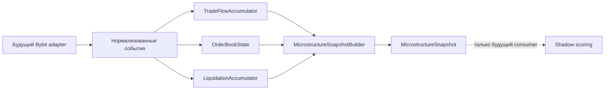

# QTR Micro Scalper V2 — Data Layer Implementation Plan

Статус: **план реализации, production-код не подключён**

Связанный документ: `QTR_MICRO_SCALPER_V2_DESIGN.md`.

## 1. Границы этапа

Этап создаёт изолированный пакет нормализации и агрегации публичной
микроструктуры рынка:

```text
src/market_signal_assistant/qtr_micro_scalper/
├── __init__.py
├── settings.py
└── data/
    ├── __init__.py
    ├── models.py
    ├── trades.py
    ├── orderbook.py
    ├── liquidations.py
    └── snapshots.py
```

Data Layer не импортирует `qtr_micro.execution`, broker/client, trading state,
journal или Telegram. На этом этапе он не открывает WebSocket, не вызывает REST
и не отправляет ордера. Bybit transport/parser будет отдельным adapter-этапом.

V1 остаётся production baseline. Новый пакет не включается в V1 runtime и не
меняет Entry, Risk, leverage, stop, TP1/TP2, runner или reconciliation.

## 2. Направление зависимостей



Разрешённое направление импортов:

```text
settings.py
models.py <- trades.py
models.py <- orderbook.py
models.py <- liquidations.py
models.py + aggregators <- snapshots.py
```

`models.py` не импортирует остальные модули. Ни один модуль Data Layer не знает
о signal candidate, position или order.

## 3. `data/models.py`

Все публичные модели реализуются как `@dataclass(frozen=True, slots=True)`.
Коллекции внутри immutable-моделей — только tuple. Время всегда timezone-aware
и нормализуется в UTC. Символ нормализуется в uppercase.

Общие правила числовых полей:

- `bool` не считается числом;
- `NaN` и infinity запрещены;
- price и quantity должны быть положительными;
- sequence/update identifiers должны быть неотрицательными;
- отсутствующая производная метрика представляется `None`, а не нулём.

### 3.1 `PublicTradeEvent`

```text
PublicTradeEvent
  schema_version: int = 1
  symbol: str
  trade_id: str
  exchange_at: datetime
  received_at: datetime
  side: TradeSide                 # BUY | SELL, taker side
  price: float
  quantity: float
  quote_notional: float           # вычисляется явно: price * quantity
  sequence: int | None
  is_block_trade: bool
  is_rpi_trade: bool
```

Инварианты:

- `received_at` не может опережать `exchange_at` более чем на допустимый clock
  tolerance, проверяемый health-layer, а не самой доменной моделью;
- `quote_notional` должен совпадать с `price * quantity` в пределах заданной
  floating-point tolerance;
- stable identity для дедупликации: `(symbol, trade_id)`;
- sequence сохраняется для provenance, но не является идентификатором сделки.

### 3.2 `OrderBookEvent`

```text
OrderBookLevel
  price: float
  quantity: float                 # zero разрешён только в DELTA как delete

OrderBookEvent
  schema_version: int = 1
  symbol: str
  event_type: OrderBookEventType  # SNAPSHOT | DELTA
  exchange_at: datetime
  received_at: datetime
  update_id: int
  cross_sequence: int | None
  bids: tuple[OrderBookLevel, ...]
  asks: tuple[OrderBookLevel, ...]
```

Инварианты:

- snapshot содержит только положительные quantities;
- delta с quantity `0` означает удаление price level;
- повторяющиеся цены внутри одной стороны одного event запрещены;
- сортировка входного event не считается гарантией корректной локальной книги;
  `OrderBookState` всегда нормализует bids descending и asks ascending;
- пустой delta допустим, пустой начальный snapshot не делает книгу ready.

### 3.3 `LiquidationEvent`

```text
LiquidationEvent
  schema_version: int = 1
  symbol: str
  liquidation_id: str | None
  exchange_at: datetime
  received_at: datetime
  side: LiquidationSide           # LONG | SHORT — сторона ликвидированной позиции
  bankruptcy_price: float
  quantity: float
  quote_notional: float           # bankruptcy_price * quantity
  sequence: int | None
```

Модель хранит уже нормализованную сторону позиции. Bybit mapping остаётся в
adapter: wire `Buy` означает ликвидацию LONG, wire `Sell` — ликвидацию SHORT.

### 3.4 `MicrostructureSnapshot`

Snapshot является единственным immutable-выходом Data Layer:

```text
MicrostructureSnapshot
  schema_version: int
  symbol: str
  generated_at: datetime
  window_started_at: datetime

  market_price: float | None
  best_bid: float | None
  best_ask: float | None
  mid_price: float | None
  microprice: float | None
  spread_bps: float | None

  bid_depth_5bps: float | None
  ask_depth_5bps: float | None
  bid_depth_10bps: float | None
  ask_depth_10bps: float | None
  bid_depth_25bps: float | None
  ask_depth_25bps: float | None
  imbalance_l1: float | None
  imbalance_l5: float | None
  imbalance_l10: float | None
  imbalance_l25: float | None
  imbalance_l50: float | None

  buy_notional_1s: float | None
  sell_notional_1s: float | None
  delta_1s: float | None
  delta_5s: float | None
  delta_15s: float | None
  delta_60s: float | None
  cvd_process: float | None
  cvd_utc_day: float | None
  cvd_episode: float | None
  trade_count_5s: int | None
  largest_trade_5s: float | None

  long_liquidations_5s: float | None
  short_liquidations_5s: float | None
  long_liquidations_60s: float | None
  short_liquidations_60s: float | None
  liquidation_imbalance_60s: float | None

  book_exchange_at: datetime | None
  trade_exchange_at: datetime | None
  liquidation_exchange_at: datetime | None
  book_age_ms: float | None
  trade_age_ms: float | None
  liquidation_age_ms: float | None
  dropped_events: int
  reconnect_count: int
  ready: bool
  health_reasons: tuple[str, ...]
```

Поля sweep, slope, slippage и z-score добавляются следующими совместимыми
schema revisions после появления достаточных replay-данных. Это предотвращает
создание фиктивных значений ради заполнения полной будущей схемы.

Snapshot `ready=True` только при одновременно валидной книге, наличии trade
history, актуальности обязательных источников и отсутствии event loss. Отсутствие
liquidation events при здоровом stream означает нулевой flow. Неактивный или
stale stream даёт liquidation metrics `None`.

## 4. `data/trades.py`

Основной объект: `TradeFlowAccumulator`.

Ответственность:

- принимать только `PublicTradeEvent`;
- дедуплицировать по `(symbol, trade_id)`;
- хранить bounded rolling window не менее 60 секунд плюс late-arrival margin;
- считать signed quote flow: BUY положительный, SELL отрицательный;
- исключать block trades из primary delta/CVD по умолчанию;
- сохранять block/RPI flow отдельно для будущей диагностики;
- считать окна 1s/5s/15s/60s относительно явно переданного `as_of`;
- поддерживать `cvd_process`, `cvd_utc_day` и явно сбрасываемый `cvd_episode`;
- не использовать wall clock внутри вычислений, кроме инъецированного clock.

Предлагаемый read API:

```text
ingest(event) -> IngestResult      # accepted | duplicate | late
metrics(symbol, as_of) -> TradeFlowMetrics
start_episode(symbol, at) -> None
reset_process_session(at) -> None
```

Позднее событие внутри retention учитывается в соответствующем rolling window.
Событие вне retention не меняет CVD и отмечается как late/dropped diagnostic.

## 5. `data/orderbook.py`

Основной объект: `OrderBookState` на один symbol. Multi-symbol routing остаётся
в service/adapter и не усложняет book invariants.

Ответственность:

- snapshot полностью заменяет локальное состояние;
- delta применяется только после snapshot;
- `quantity=0` удаляет уровень;
- update gap, rollback update ID или crossed book переводят state в NOT_READY;
- новый snapshot восстанавливает state после desync;
- хранится максимум согласованной depth, для V2 baseline — L50;
- расчёт метрик выполняется из одной согласованной версии книги.

Метрики первой итерации:

```text
best_bid / best_ask
mid_price
spread_bps
microprice
bid/ask quote depth в полосах 5/10/25 bps
imbalance top 1/5/10/25/50
last exchange timestamp
last update ID / cross sequence
ready / health reasons
```

Формулы:

```text
mid = (best_bid + best_ask) / 2
spread_bps = (best_ask - best_bid) / mid * 10_000
imbalance = (bid_qty - ask_qty) / (bid_qty + ask_qty)
microprice =
  (best_ask * best_bid_qty + best_bid * best_ask_qty)
  / (best_bid_qty + best_ask_qty)
```

Depth считается в quote notional (`price * quantity`), не в base quantity.

## 6. `data/liquidations.py`

Основной объект: `LiquidationAccumulator`.

Ответственность:

- принимать нормализованный `LiquidationEvent`;
- дедуплицировать по liquidation ID, когда ID доступен;
- при отсутствии ID использовать bounded composite identity из symbol, time,
  side, price и quantity;
- считать LONG/SHORT quote notional за 5 и 60 секунд;
- считать 60s imbalance только при положительном total flow;
- различать healthy empty stream (`0`) и unavailable/stale stream (`None`);
- удалять события старше retention без неограниченного роста памяти.

```text
liquidation_imbalance =
  (short_liquidations - long_liquidations)
  / (short_liquidations + long_liquidations)
```

Положительное значение показывает преобладание ликвидаций SHORT, отрицательное —
ликвидаций LONG. Это контекст принудительного закрытия, а не самостоятельный
LONG/SHORT сигнал.

## 7. `data/snapshots.py`

Основной объект: `MicrostructureSnapshotBuilder`.

Builder не владеет сетью. Он получает read-only views/metrics от трёх
агрегаторов и строит согласованный snapshot для одного `as_of`.

Порядок сборки:

1. Зафиксировать `generated_at` через injected UTC clock.
2. Прочитать book metrics одной версии.
3. Прочитать trade metrics на тот же `as_of`.
4. Прочитать liquidation metrics на тот же `as_of`.
5. Рассчитать source ages и собрать health reasons.
6. Установить `ready` только после обязательных health gates.
7. Вернуть immutable snapshot без мутации агрегаторов.

Обязательные gates первой итерации:

- symbol совпадает у всех источников;
- orderbook получил snapshot и не находится в desync;
- bid/ask положительны и `best_bid < best_ask`;
- есть хотя бы одна принятая public trade;
- book/trades не stale относительно настроек;
- dropped events равны нулю;
- timestamps timezone-aware.

Liquidation stream optional. Его недоступность добавляется в health reasons, но
сама по себе не блокирует shadow snapshot. Consumer обязан видеть `None` и не
трактовать его как отсутствие ликвидаций.

## 8. Конфигурация

Канонические настройки этого этапа:

```text
QTR_SCALPER_V2_ENABLED=false
QTR_SCALPER_SHADOW_MODE=true
```

Они размещаются в `qtr_micro_scalper/settings.py`:

```text
QtrScalperV2Settings
  enabled: bool = False
  shadow_mode: bool = True
```

Правила:

- environment parser принимает только `true` или `false` без учёта регистра;
- импорт settings не читает сеть и не создаёт Data Layer objects;
- `from_environment()` выполняет чтение только при явном вызове;
- `enabled=False` означает отсутствие запуска collectors;
- `shadow_mode=True` запрещает execution integration;
- комбинация `enabled=True, shadow_mode=False` на этом этапе отклоняется как
  неподдерживаемая: V2 ещё не имеет права влиять на ордера;
- существующие черновые имена `QTR_SCALPER_DATA_ENABLED` и
  `QTR_SCALPER_SHADOW_ENABLED` не используются как aliases, чтобы избежать двух
  источников истины.

Дополнительные freshness/depth параметры вводятся только вместе с collector
adapter, когда появятся lifecycle и live calibration. До этого unit tests
передают thresholds явно в constructors.

## 9. План TDD

### Этап A — immutable models

Тесты до реализации:

- нормализация symbol и UTC;
- отклонение naive datetime;
- отклонение пустого symbol/trade ID;
- finite/positive price и quantity;
- явная проверка quote notional;
- frozen dataclasses не мутируются;
- snapshot допускает `None`, но не NaN;
- `ready=True` несовместим с непустыми blocking health reasons.

### Этап B — trades

- BUY/Sell signed notional;
- delta для 1s/5s/15s/60s на границах окон;
- duplicate trade не меняет delta и CVD;
- одинаковый sequence у разных trade IDs не считается дублем;
- block trade исключён из primary CVD;
- RPI flag сохраняется;
- UTC-day reset;
- episode reset;
- late event вне retention не меняет totals;
- multi-symbol isolation;
- bounded retention.

### Этап C — orderbook

- snapshot создаёт готовую отсортированную L50 книгу;
- delta add/update/delete;
- delta до snapshot оставляет NOT_READY;
- update gap переводит state в desync;
- новый snapshot восстанавливает state;
- crossed/empty book не ready;
- mid, spread, microprice;
- imbalance L1/L5/L10/L25/L50;
- depth bands 5/10/25 bps;
- zero denominator даёт `None`;
- входные event/models не мутируются.

### Этап D — liquidations

- LONG/SHORT mapping тестируется на adapter boundary отдельно;
- 5s/60s windows и точные границы;
- quote notional aggregation;
- duplicate suppression с ID и composite identity;
- healthy empty stream возвращает zero;
- unavailable/stale stream возвращает `None`;
- multi-symbol isolation;
- bounded retention.

### Этап E — snapshots

- полный healthy snapshot `ready=True`;
- missing book snapshot;
- desynchronized/crossed book;
- no trade history;
- stale book;
- stale trades;
- optional liquidation unavailable;
- dropped event gate;
- source ages рассчитаны от одного `generated_at`;
- snapshot immutable;
- повторная сборка не мутирует accumulators.

### Этап F — settings и import safety

- defaults: V2 disabled, shadow enabled;
- environment true/false parsing;
- invalid boolean controlled error;
- `enabled=True, shadow_mode=False` отклоняется;
- import package не открывает HTTP/WebSocket;
- создание settings не запускает collectors;
- package работает без `pybit`;
- нет импортов execution/broker/Telegram.

Все тесты используют deterministic UTC clock и синтетические события. Реальные
HTTP, WebSocket, Bybit Demo и Telegram запрещены.

## 10. Предлагаемые test files

```text
tests/qtr_micro_scalper/
├── test_models.py
├── test_trades.py
├── test_orderbook.py
├── test_liquidations.py
├── test_snapshots.py
├── test_settings.py
└── test_import_safety.py
```

Тесты Data Layer не импортируют V1 execution fixtures и не используют API keys.

## 11. Последовательность реализации

1. Создать package и написать failing model/settings tests.
2. Реализовать immutable models и безопасные defaults.
3. Написать и реализовать `TradeFlowAccumulator`.
4. Написать и реализовать deterministic `OrderBookState`.
5. Написать и реализовать `LiquidationAccumulator`.
6. Собрать `MicrostructureSnapshotBuilder` и readiness gates.
7. Выполнить offline replay/property tests на перестановку и дубли событий.
8. Выполнить полный `pytest`, strict `mypy`, Ruff и `git diff --check`.
9. Только отдельным подтверждённым этапом добавить Bybit WebSocket adapter.
10. Только после накопления shadow evidence рассматривать scoring integration.

Каждый шаг оставляет `QTR_SCALPER_V2_ENABLED=false`. Наличие импортируемого пакета
не означает, что V2 запущен.

## 12. Критерии готовности Data Layer V2

Этап завершён, когда:

- четыре immutable-модели имеют документированные единицы и инварианты;
- rolling calculations детерминированы для одного набора событий;
- orderbook корректно восстанавливается только через snapshot;
- stale, missing и zero различаются явно;
- snapshot объясняет `ready=False` через typed/стабильные health reasons;
- defaults гарантируют disabled + shadow-only режим;
- imports и constructors не открывают сеть;
- все тесты offline и проходят strict quality checks;
- V1 runtime и результаты V1 не изменены.
