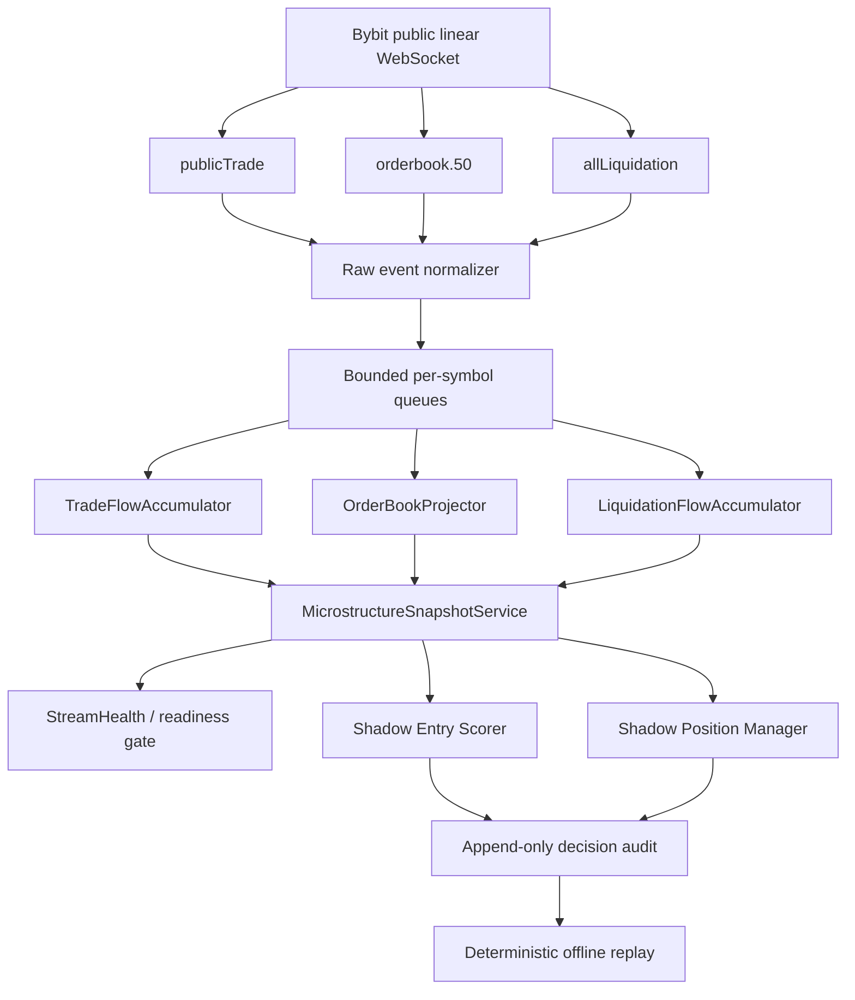

# QTR Micro Scalper V2 — Design Document

Статус: **предлагаемый дизайн, реализация не начата**
Режим первого внедрения: **shadow-only**
Совместимость: **QTR Micro V1 остаётся неизменным и является production baseline**

## 1. Назначение

QTR Micro Scalper V2 добавляет событийный слой рыночной микроструктуры поверх
публичных данных Bybit. Он должен отвечать на вопрос не только «есть ли технический
setup», но и «подтверждает ли текущий поток сделок и ликвидности возможность
исполнить этот setup сейчас».

V2 не заменяет и не модифицирует V1 на первом этапе. Он независимо:

- принимает public trades, orderbook и liquidation events;
- строит объяснимый `MicrostructureSnapshot`;
- рассчитывает shadow entry/management decisions;
- сохраняет решения для offline replay и out-of-sample проверки;
- не вызывает broker/execution и не отправляет ордера.

### 1.1 Цели

- уменьшить поздние входы после уже реализованного импульса;
- отличать реальный агрессивный поток от движения на тонкой книге;
- обнаруживать liquidity sweep и последующее восстановление либо продолжение;
- измерять качество входа на горизонтах секунд и минут;
- подготовить безопасный путь к отдельному V2 Demo runtime.

### 1.2 Не-цели

- изменение QTR Micro V1 entry, risk, leverage, stop, TP или runner;
- включение автоматической торговли из shadow mode;
- HFT/MM стратегия или гарантированное sub-millisecond исполнение;
- использование приватных данных чужих аккаунтов;
- трактовка orderbook size reduction как доказанного fill без подтверждения trades;
- использование SBE/MMWS в первой версии.

## 2. Архитектура



V1 и V2 не должны импортировать друг друга на уровне доменного ядра. Будущий
integration adapter может читать одновременно `QtrSetupCandidate` и
`MicrostructureSnapshot`, но сам V1 остаётся отдельным execution path.

## 3. Data Layer

### 3.1 Bybit topics

Для linear USDT instruments используется публичное соединение:

```text
wss://stream.bybit.com/v5/public/linear
```

Подписки на каждый активный symbol:

```text
publicTrade.{symbol}
orderbook.50.{symbol}
allLiquidation.{symbol}
```

Рекомендуемый depth — L50. L1 слишком узок и приходит только snapshots, L200 и
L1000 создают лишнюю нагрузку для первой версии.

### 3.2 Lifecycle

- import, constructor и composition не открывают сеть;
- сеть открывается только через явный `start(symbols)`;
- `stop()` идемпотентен;
- subscribe/unsubscribe выполняются без переподключения, когда возможно;
- heartbeat отправляется каждые 20 секунд;
- reconnect использует bounded exponential backoff с jitter;
- после reconnect orderbook считается `NOT_READY` до нового snapshot;
- при shutdown consumer tasks отменяются, очереди закрываются, state flush
  ограничен timeout;
- отсутствие optional WebSocket dependency не ломает V1 CLI/Telegram/runtime.

### 3.3 Нормализованные события

```text
PublicTrade
  symbol
  trade_id
  taker_side: BUY | SELL
  price
  quantity
  quote_notional
  exchange_at                 # Bybit T
  generated_at                # Bybit ts
  received_at                 # UTC wall clock
  received_monotonic_ns
  sequence
  is_block_trade
  is_rpi_trade

OrderBookUpdate
  symbol
  update_type: SNAPSHOT | DELTA
  bids: tuple[PriceLevel, ...]
  asks: tuple[PriceLevel, ...]
  update_id                   # u
  sequence                    # seq
  matching_engine_at          # cts
  generated_at                # ts
  received_at
  received_monotonic_ns

LiquidationEvent
  symbol
  liquidated_side: LONG | SHORT
  price                       # bankruptcy price
  quantity
  quote_notional
  exchange_at                 # T
  generated_at                # ts
  received_at
  received_monotonic_ns
```

Все модели immutable. Decimal conversion выполняется на границе provider. Внутри
горячего пути допустимы заранее нормализованные integer ticks/lots либо `float`,
если equivalence tests подтверждают отсутствие значимой ошибки.

### 3.4 Очереди и concurrency

- один writer/actor на symbol для orderbook;
- отдельные bounded queues для trades, book и liquidations;
- callback WebSocket только валидирует envelope и ставит событие в очередь;
- тяжёлые расчёты не выполняются в callback;
- любое переполнение очереди увеличивает `dropped_events`, переводит поток в
  `NOT_READY` и инициирует resubscribe orderbook;
- silent drop запрещён;
- snapshot читается потребителями через immutable copy/reference swap.

### 3.5 Durable audit

Полный поток orderbook нельзя бесконтрольно писать в один JSONL. Предлагается:

```text
data/qtr_scalper_v2/raw/YYYY-MM-DD/{symbol}/{hour}.jsonl.gz
data/qtr_scalper_v2/snapshots/YYYY-MM-DD/{symbol}.jsonl
data/qtr_scalper_v2/decisions.jsonl
data/qtr_scalper_v2/health.jsonl
data/qtr_scalper_v2/checkpoints.json
```

Raw capture включается отдельным флагом, файлы ротируются по symbol/hour. Decision
audit хранит только признаки, score, решение, причины и provenance sequence IDs.

## 4. MicrostructureSnapshot

`MicrostructureSnapshot` — единый immutable вход для scoring и shadow management.
Он не содержит broker, order, position или API credential objects.

```text
MicrostructureSnapshot
  schema_version
  symbol
  generated_at
  window_started_at

  market_price
  best_bid
  best_ask
  mid_price
  microprice
  spread_bps

  bid_depth_5bps
  ask_depth_5bps
  bid_depth_10bps
  ask_depth_10bps
  bid_depth_25bps
  ask_depth_25bps
  imbalance_l1
  imbalance_l5
  imbalance_l10
  imbalance_l25
  imbalance_l50
  book_slope_bid
  book_slope_ask
  estimated_buy_slippage_bps
  estimated_sell_slippage_bps

  buy_notional_1s
  sell_notional_1s
  delta_1s
  delta_5s
  delta_15s
  delta_60s
  cvd_session
  cvd_slope_5s
  cvd_slope_15s
  trade_count_5s
  largest_trade_5s

  long_liquidations_5s
  short_liquidations_5s
  long_liquidations_60s
  short_liquidations_60s
  liquidation_imbalance_60s
  liquidation_burst_zscore

  sweep_direction: UP | DOWN | NONE
  sweep_score
  sweep_started_at
  swept_notional
  levels_consumed
  post_sweep_recovery

  book_exchange_at
  trade_exchange_at
  liquidation_exchange_at
  book_age_ms
  trade_age_ms
  liquidation_age_ms
  queue_delay_ms
  dropped_events
  reconnect_count
  ready
  health_reasons
```

Недоступная метрика равна `None`, а не нулю. `ready=False`, если отсутствует хотя
бы один обязательный источник либо нарушена целостность книги.

### 4.1 Readiness gate

Для shadow scoring обязательны:

- актуальный L50 snapshot;
- отсутствие локально потерянных book events после snapshot;
- хотя бы минимальная история public trades;
- положительные bid/ask и непротиворечивая книга;
- NTP-aware UTC clock;
- book/trade freshness внутри настроенного порога;
- отсутствие queue overflow.

Liquidations являются optional context: отсутствие событий означает нулевой
поток только при здоровой подписке. Неактивная или stale подписка даёт `None`.

## 5. Delta/CVD logic

### 5.1 Signed flow

Для linear USDT:

```text
quote_notional = price * quantity
signed_notional = +quote_notional  if taker_side == BUY
signed_notional = -quote_notional  if taker_side == SELL
delta(window) = sum(signed_notional)
```

Положительная delta означает доминирование агрессивных покупателей, отрицательная
— агрессивных продавцов. Это venue-local taker flow, а не глобальный рынок.

### 5.2 Deduplication и ordering

- primary identity: `(symbol, trade_id)`;
- `seq` используется для provenance/диагностики, но не как уникальный ID;
- внутри Bybit message trades уже отсортированы по matching time;
- события распределяются по rolling buckets по `exchange_at`;
- bounded late-arrival allowance используется для закрываемых audit buckets;
- уже учтённый trade ID никогда не меняет CVD повторно;
- bounded dedup cache очищается только после превышения максимального окна плюс
  safety margin.

### 5.3 CVD sessions

Поддерживаются три независимых значения:

- `cvd_process` — от старта процесса;
- `cvd_utc_day` — reset в 00:00 UTC;
- `cvd_episode` — reset при начале нового Setup episode.

Checkpoint хранит last trade IDs, cumulative totals и timestamp. При повреждении
checkpoint сервис стартует с новой явно обозначенной session, не выдумывая
непрерывность.

### 5.4 Block/RPI policy

- обычный CVD исключает `BT=true` по умолчанию;
- block flow хранится отдельной метрикой;
- RPI trades маркируются отдельно, потому что обычный orderbook не показывает
  RPI liquidity;
- shadow audit сохраняет обе версии delta: inclusive и primary-filtered.

## 6. Orderbook metrics

### 6.1 Базовые метрики

```text
mid = (best_bid + best_ask) / 2
spread_bps = (best_ask - best_bid) / mid * 10_000

imbalance_N = (bid_qty_N - ask_qty_N) / (bid_qty_N + ask_qty_N)

microprice =
  (best_ask * best_bid_qty + best_bid * best_ask_qty)
  / (best_bid_qty + best_ask_qty)
```

Imbalance считается отдельно для top 1/5/10/25/50 levels и для ценовых полос
5/10/25 bps. Деление на ноль даёт `None`.

### 6.2 Execution-aware depth

Для заданного hypothetical quote notional рассчитываются:

- средняя цена прохода по уровням;
- slippage относительно mid;
- количество потреблённых уровней;
- доступный notional до заданного bps limit;
- depth asymmetry для LONG и SHORT.

Эта оценка диагностическая и не заменяет реальные instrument/order constraints.

### 6.3 Изменения книги

В rolling windows считать:

- added bid/ask liquidity;
- removed bid/ask liquidity;
- replenishment после trade burst;
- depletion без восстановления;
- скорость изменения imbalance;
- lifetime крупных уровней.

Removed size нельзя называть cancel или fill без сопоставления с public trades.

## 7. Liquidity sweep detection

Sweep — последовательность агрессивных сделок одного направления, которая быстро
потребляет несколько уровней книги и сдвигает best price.

### 7.1 Upward sweep

Кандидат `UP`, если в коротком окне одновременно:

- taker buy notional превышает адаптивный baseline;
- ask depth уменьшается на нескольких уровнях;
- best ask/mid сдвигается вверх;
- consumed levels не меньше настроенного минимума;
- signed delta положительна;
- движение превышает minimum tick/noise threshold.

Для `DOWN` правила симметричны.

### 7.2 Sweep score

```text
sweep_score =
    0.30 * normalized_aggressive_notional
  + 0.20 * normalized_levels_consumed
  + 0.20 * normalized_price_displacement
  + 0.15 * normalized_depth_depletion
  + 0.15 * normalized_delta_acceleration
```

Все компоненты нормализуются относительно rolling symbol baseline, а не общим
фиксированным USDT-порогом.

### 7.3 Классификация после sweep

- `CONTINUATION`: цена удержалась за sweep level, CVD и book imbalance не
  развернулись;
- `ABSORPTION`: большой aggressive flow не дал соответствующего движения;
- `REJECTION`: цена быстро вернулась, противоположная сторона восстановила depth;
- `UNCONFIRMED`: недостаточно данных либо snapshot стал stale.

Sweep сам по себе не создаёт entry. Он только усиливает либо ослабляет уже
существующий directional setup.

## 8. Entry scoring

V2 использует отдельные `long_score` и `short_score` на шкале 0..100. Score не
заменяет V1 score и не должен записываться в V1 state.

### 8.1 Hard gates

Entry запрещён независимо от score, если:

- snapshot `ready=False`;
- book или trades stale;
- были dropped events после последнего snapshot;
- spread выше execution-safe порога;
- ожидаемый slippage превышает лимит;
- доступная depth недостаточна для planned notional;
- setup стал CANCELLED/late;
- safety/risk/preflight V1 baseline не допускает вход;
- направление microstructure резко противоречит setup.

### 8.2 Предлагаемая shadow decomposition

| Компонент | Вес |
|---|---:|
| Setup context из стабильного technical candidate | 20 |
| Delta 1s/5s/15s | 20 |
| CVD slope и acceleration | 10 |
| Multi-level orderbook imbalance | 15 |
| Sweep/absorption/rejection state | 15 |
| Spread, depth и estimated slippage | 10 |
| Liquidation context | 5 |
| Freshness и temporal alignment | 5 |
| **Итого** | **100** |

Каждый компонент формирует отдельные confirmations и warnings. Никакой фактор
не должен быть скрыт внутри одного непрозрачного числа.

### 8.3 Shadow decision

```text
ScalperEntryAssessment
  symbol
  setup_episode_id
  assessed_at
  setup_direction
  long_score
  short_score
  selected_direction
  score_margin
  hard_gates_passed
  confirmations
  warnings
  blocking_reasons
  snapshot_provenance
  decision: PASS | WAIT | REJECT
```

Начальные thresholds являются только calibration candidates. До offline и
out-of-sample анализа они не становятся trading thresholds. В shadow report
следует собирать распределение результатов для score bands, а не объявлять
фиксированный production cut-off заранее.

## 9. Position management

V2 management проектируется отдельно от V1. На миграционных этапах он только
вычисляет shadow actions.

### 9.1 Инварианты безопасности

- биржевой protective structural stop устанавливается сразу после fill;
- microstructure никогда не расширяет stop;
- stale data запрещает новые entries;
- потеря public stream сама по себе не инициирует панический market exit;
- при деградации V2 открытая позиция возвращается под V1 management + exchange SL;
- все reduce/exit решения в будущем используют reduce-only;
- foreign/manual positions не управляются.

### 9.2 Shadow actions

```text
HOLD
TIGHTEN_STOP
TAKE_PARTIAL
EXIT_FLOW_REVERSAL
EXIT_LIQUIDITY_VACUUM
EXIT_FAILED_SWEEP
FALLBACK_TO_V1
```

### 9.3 Signals управления

Усиление позиции:

- delta продолжает направление;
- CVD slope сохраняется;
- book imbalance подтверждает направление;
- после sweep происходит удержание и replenishment со стороны позиции.

Ослабление:

- delta разворачивается на нескольких окнах;
- aggressive flow поглощается без движения;
- исчезает supporting depth;
- возникает противоположный sweep;
- microprice устойчиво смещается против позиции;
- spread/slippage резко ухудшаются.

Один tick или единичный orderbook delta не должен закрывать позицию. Требуются
hysteresis, minimum persistence и несколько независимых подтверждений.

### 9.4 TP и runner в миграции

На shadow-этапе реальные TP1/TP2/BE/runner остаются полностью под V1. V2 только
записывает альтернативные timestamps действий и сравнивает:

- V1 exit;
- hypothetical V2 partial/exit;
- MFE/MAE после каждого решения;
- fees и estimated slippage;
- долю ложных ранних выходов.

Любое изменение реального management допускается только в отдельном V2 Demo
runtime после подтверждённого out-of-sample результата.

## 10. Shadow mode

### 10.1 Поведение

- WebSocket запускается только явным lifecycle-вызовом;
- строятся snapshots и assessments;
- реальные V1 candidates могут использоваться как read-only reference;
- order client, execution service и state store V1 не передаются в shadow layer;
- Telegram торговые сообщения не отправляются;
- никакие Demo/live orders не создаются;
- ошибки V2 не влияют на V1 scan/runtime;
- каждый decision содержит provenance и data-health status.

### 10.2 Сравнение с V1

Для каждого V1 candidate/trade сохранять:

- решение V1;
- одновременный V2 shadow score;
- delay между setup и V2 PASS;
- цену V1 entry и hypothetical V2 entry;
- adverse/favorable excursion через 5s/15s/30s/1m/5m/15m;
- достигнут ли TP1 до structural failure;
- избежал бы V2 заведомо позднего/тонкого входа;
- пропустил ли V2 прибыльный V1 trade;
- data availability и latency percentile.

### 10.3 Критерии выхода из shadow

- минимум 30 дней стабильного capture;
- достаточная выборка независимых setup episodes;
- отсутствие silent gaps и повреждённых books;
- воспроизводимый deterministic replay;
- latency SLO выполняется в нормальном и волатильном рынке;
- улучшение net-after-fees на out-of-sample;
- не ухудшены tail loss и false-negative rate сверх согласованного лимита;
- результаты устойчивы по symbols и volatility regimes.

## 11. Migration path V1 → V2

### Phase 0 — Design freeze

- утвердить schema, timestamps, definitions и health semantics;
- зафиксировать hash/golden behavior V1;
- production code не менять.

### Phase 1 — Data capture

- добавить изолированный optional package;
- public trades, L50 book, expanded liquidations;
- health/audit only;
- feature flag default `false`.

### Phase 2 — Offline replay

- deterministic raw replay;
- unit/integration/property tests;
- измерение gaps, duplicates, late events и latency.

### Phase 3 — Shadow entry scoring

- читать V1 candidates через read-only adapter;
- вычислять `ScalperEntryAssessment`;
- не изменять решения V1.

### Phase 4 — Shadow position management

- рассчитывать hypothetical actions;
- сравнивать с фактическим V1 lifecycle;
- учитывать fees и slippage.

### Phase 5 — Isolated V2 Demo

- отдельный runtime и отдельный state/audit;
- жёсткий Demo-only guard;
- V1 остаётся default и не разделяет открытые позиции с V2;
- минимальный notional/risk только после отдельного разрешения.

### Phase 6 — Controlled migration

- explicit operator opt-in;
- ограниченный symbol allowlist;
- canary sessions;
- автоматический fallback запрещает новые V2 entries, но не бросает открытую
  позицию без exchange protection;
- rollback означает отключение V2 flag, а не изменение V1.

## 12. Предлагаемые модули

```text
src/market_signal_assistant/scalper_data/
├── __init__.py
├── models.py
├── provider.py
├── service.py
├── health.py
├── trade_flow.py
├── orderbook.py
├── liquidations.py
├── sweep.py
├── scoring.py
├── shadow_management.py
├── audit.py
└── replay.py

src/market_signal_assistant/providers/
└── bybit_scalper_ws.py
```

Новый package не импортирует `qtr_micro.execution` и не имеет методов отправки
ордеров.

## 13. Конфигурация

```text
QTR_SCALPER_DATA_ENABLED=false
QTR_SCALPER_SHADOW_ENABLED=false
QTR_SCALPER_SYMBOLS=BTCUSDT,ETHUSDT
QTR_SCALPER_ORDERBOOK_DEPTH=50
QTR_SCALPER_RAW_CAPTURE_ENABLED=false
QTR_SCALPER_QUEUE_CAPACITY=10000
QTR_SCALPER_BOOK_STALE_MS=1000
QTR_SCALPER_TRADE_STALE_MS=750
QTR_SCALPER_LIQUIDATION_STALE_MS=2000
QTR_SCALPER_RECONNECT_MIN_SECONDS=1
QTR_SCALPER_RECONNECT_MAX_SECONDS=30
```

Невалидная конфигурация завершается контролируемой ошибкой до открытия сети.

## 14. Latency и observability

Для каждого event измеряются:

```text
exchange_to_receive_ms
bybit_generation_delay_ms
local_queue_delay_ms
processing_delay_ms
snapshot_build_ms
event_loop_lag_ms
```

Начальные health targets, которые подлежат live calibration:

| Метрика | Target | NOT_READY |
|---|---:|---:|
| Local queue delay p99 | <=20 ms | >100 ms |
| Book age p95 | <=250 ms | >1000 ms |
| Trade age p95 | <=250 ms | >750 ms |
| Liquidation age p95 | <=1000 ms | >2000 ms |
| Snapshot build p99 | <=10 ms | >50 ms |
| Clock offset | <=25 ms | >100 ms |
| Dropped events | 0 | >0 |

Эти значения — design starting points, а не SLA Bybit и не production thresholds.

## 15. Тестовая стратегия

Обязательны:

- import/bootstrap без сети;
- explicit lazy lifecycle и идемпотентный stop;
- snapshot/delta insert/update/delete;
- новый snapshot и `u=1` полностью сбрасывают книгу;
- local queue overflow переводит поток в `NOT_READY`;
- reconnect/resubscribe;
- duplicate trade ID;
- несколько messages с одинаковым `seq`;
- Buy/Sell delta mapping;
- rolling delta windows;
- CVD checkpoint/restart;
- late/out-of-order trades;
- block/RPI separation;
- liquidation side/notional/windows;
- sweep continuation/absorption/rejection;
- stale/clock-skew gates;
- deterministic replay equivalence;
- shadow assessment не вызывает execution;
- V1 golden tests не изменяются;
- никакие реальные Bybit/Telegram/orders в tests не вызываются.

## 16. Основные риски

- публичная JSON WebSocket latency зависит от сети и региона;
- RPI liquidity отсутствует в обычном orderbook;
- burst traffic способен переполнить Python queues;
- book size reduction неоднозначен без trade correlation;
- liquidation stream имеет частоту 500 ms и запаздывает для ultra-fast trigger;
- CVD Bybit не описывает поток на других биржах;
- overfitting score weights на малой выборке;
- смешивание V1 и V2 state может создать двойное управление позицией.

Последний риск устраняется архитектурно: до Phase 5 V2 не получает execution
capability, а в Phase 5 использует отдельный Demo runtime и ownership namespace.

## 17. Решение

Первая реализация QTR Micro Scalper V2 должна ограничиться Data Layer, durable
capture, deterministic replay и shadow scoring. Реальный V1 не изменяется.
Вопрос подключения V2 к Demo execution рассматривается только после накопления
out-of-sample evidence и отдельного подтверждения оператора.

## 18. Источники Bybit

- Public trades: https://bybit-exchange.github.io/docs/v5/websocket/public/trade
- Orderbook: https://bybit-exchange.github.io/docs/v5/websocket/public/orderbook
- All liquidations: https://bybit-exchange.github.io/docs/v5/websocket/public/all-liquidation
- WebSocket connection: https://bybit-exchange.github.io/docs/v5/ws/connect
- Demo service: https://bybit-exchange.github.io/docs/v5/demo
- Rate limits: https://bybit-exchange.github.io/docs/v5/rate-limit
- Integration guidance: https://bybit-exchange.github.io/docs/v5/guide
- SBE/MMWS: https://bybit-exchange.github.io/docs/v5/sbe/sbe-basic-info
